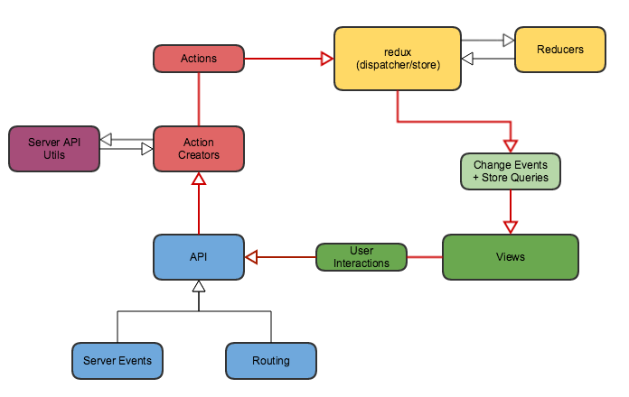

# Flux/Redux



## Code Structure

- Rails-style: separate folders for “actions”, “constants”, “reducers”, “containers”, and “components”
- Domain-style: separate folders per feature or domain, possibly with sub-folders per file type
- “Ducks”: similar to domain style, but explicitly tying together actions and reducers, often by defining them in the same file

## Setup

```bash
npm install redux react-redux --save-dev
```

## Introduction

### Store and Reducer

```javascript
import { createStore, combineReducers } from 'redux';
import { Provider } from 'react-redux';

const store = createStore(
  combineReducers({
    something: (state, action) => {},
  }),
);
```

### React Redux Provider

```javascript
<Provider store={store}>
  <MyRootComponent />
</Provider>
```

### Actions, Action creators and Reducers

```javascript
const ADD_SOME = 'ADD_SOME';
const RM_SOME = 'RM_SOME';

function addSomething(payload) {
  return {
    type: ADD_SOME,
    payload,
  };
}

function removeSomething(payload) {
  return {
    type: RM_SOME,
    payload,
  };
}

function somethingReducer(state = [], action) {
  if (action.type === ADD_SOME) {
    return state.concat([action.payload]);
  }
  if (action.type === RM_SOME) {
    return state.filter(x => x.id !== action.payload.id);
  }
  return state;
}
```

### React Enhancements

```javascript
import { bindActionCreators } from 'redux';

const MyComponent = ({ something, addSomething, removeSomething }) => {
  return (
    <div>
      <div>Count: {something.length}</div>
      <button onClick={() => addSomething({})}>Add</button>
      <button onClick={() => removeSomething({})}>Remove</button>
    </div>
  );
};

function mapStateToProps(state) {
  return {
    something: state.something,
  };
}

function mapDispatchToProps(dispatch) {
  return bindActionCreators({ addSomething, removeSomething }, dispatch);
}

export default connect(
  mapStateToProps,
  mapDispatchToProps,
)(MyComponent);
```

### Testing

```javascript
```

### Async Actions

- [Redux Thunk](https://github.com/reduxjs/redux-thunk)

```bash
npm install --save redux-thunk
```

```javascript
import { createStore, applyMiddleware } from 'redux';
import thunk from 'redux-thunk';
import rootReducer from './reducers';

const store = createStore(rootReducer, applyMiddleware(thunk));
```

## Examples

- [Example Redux App](examples/redux-app/README.md)
