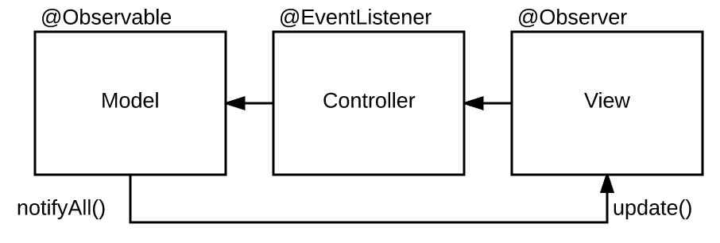

# MobX

- [MobX](https://github.com/mobxjs/mobx)



## Setup

```bash
npm install mobx mobx-react --save-dev
```

## Observable / Observer

### Model (Stream)

```javascript
import { observable } from "mobx";

const list = observable([]);
<View list={list} />;
```

### Update (Publish)

```javascript
setTimeout(() => {
  list.push({});
}, 10000);
```

### View (Subscribe)

```javascript
import { observer } from "mobx-react";
export function View() {}
export default observer(View);
```
