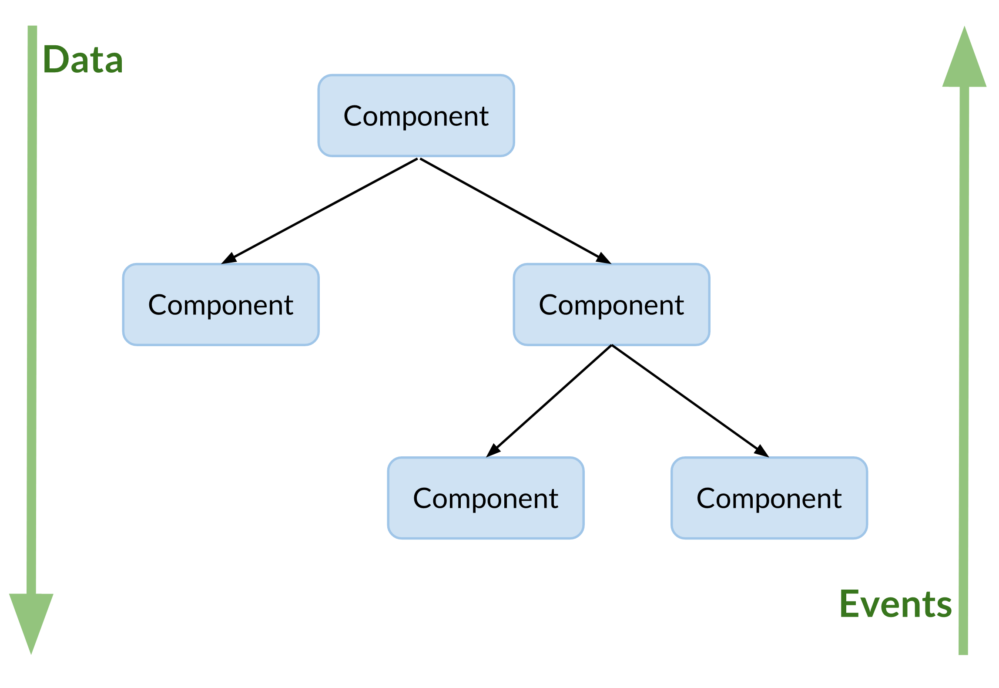

# Event- and Data-Binding

## Event-Handler

```javascript
const MyComponentSimpleHandler = props => <button onClick={e => alert('Alert!')}>Alert</button>
const MyComponent = props => <input type="text" onBlur={e => alert(e.target.value)} />
```

* [Event-Handler Example](/examples/basic-app/src/components/EventHandler.js)

## Data-Flow



* One-way from parent to child components
* Structure applications in pages as parents and components as childs
* prefer childs as reusable, stateless and functional components
* childs with __internal__ state are possible
* parents (aka pages) manage state for childs

## Communication between components

* Passing data down via component in `props`
* Passing events up via component callbacks in `props`
* Using Pub/Sub (e.g. via EventEmitter)
* Using data binding libraries e.g. Flux, Redux, Falcor, GraphQL Relay, GraphQL Apollo, etc.